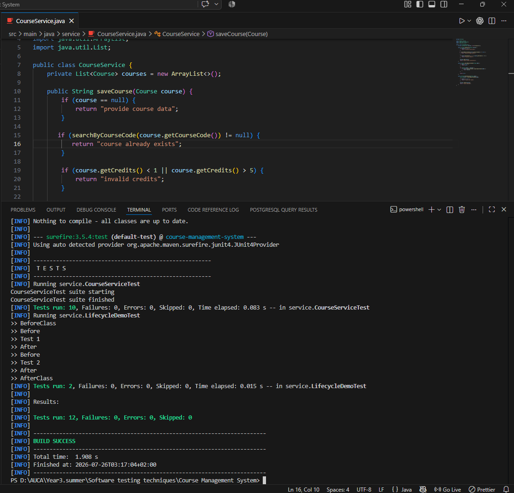
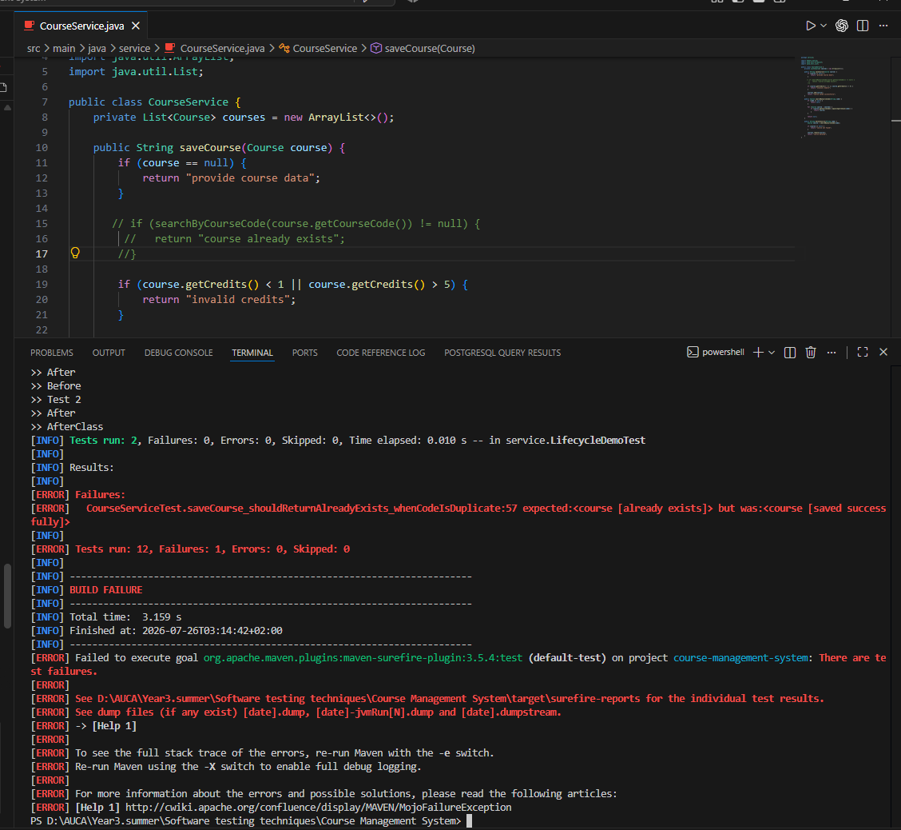

# Course Management System

**Student:** Nganucye Singizwa Valentin
**Student ID:** 27201
**Course:** Software Testing — Summer Semester, 2025–2026
**University:** AUCA

---

## About

A Maven/JUnit 4 project that implements and tests the business rules of an academic course management system. Built as part of a software testing practical assignment.

---

## Project Structure

```
Course Management System/
├── src/
│   ├── main/java/
│   │   ├── domain/
│   │   │   └── Course.java          # Entity: courseCode, courseName, credits, maxStudents
│   │   └── service/
│   │       └── CourseService.java   # Business logic: save, search, delete
│   └── test/java/service/
│       ├── LifecycleDemoTest.java   # Warm-up: proves JUnit 4 lifecycle order
│       └── CourseServiceTest.java   # 10 tests covering all business rules
├── Testing_Images/
│   ├── test1_failure_commenting_on_line_13_15.png
│   └── test1_mvn_test_build_successfull_removing_comments.png
├── TESTING_REPORT.md
└── pom.xml
```

---

## Business Rules

| Method | Condition | Returns |
|---|---|---|
| `saveCourse(Course c)` | course is null | `"provide course data"` |
| `saveCourse(Course c)` | duplicate courseCode (case-insensitive) | `"course already exists"` |
| `saveCourse(Course c)` | credits not between 1 and 5 | `"invalid credits"` |
| `saveCourse(Course c)` | valid course | `"course saved successfully"` |
| `searchByCourseCode(String code)` | code found | the `Course` object |
| `searchByCourseCode(String code)` | not found or null | `null` |
| `deleteCourse(String code)` | found and removed | `"course deleted"` |
| `deleteCourse(String code)` | not found | `"course not found"` |

---

## How to Run

**Prerequisites:** Java 17+, Maven 3.x

```bash
# Clone the repo
git clone https://github.com/NGANUCYE-SINGIZWA-Valentin/Course-Management-System.git
cd Course-Management-System

# Run all tests
mvn test
```

---

## Test Results

### ✅ All Tests Passing — BUILD SUCCESS



---

### ❌ Intentional Failure — Proving Tests Detect Bugs

The duplicate-check block in `CourseService.saveCourse` was commented out to simulate a bug. The test `saveCourse_shouldReturnAlreadyExists_whenCodeIsDuplicate` immediately caught it:

```
expected:<course [already exists]> but was:<course [saved successfully]>
```



The code was then restored and all 12 tests passed again.

---

## JUnit 4 Lifecycle Annotations Used

| Annotation | Used in | Purpose |
|---|---|---|
| `@BeforeClass` | `CourseServiceTest` | Prints suite-start message once — simulates opening a shared resource |
| `@Before` | `CourseServiceTest` | Creates a fresh `CourseService` with 2 pre-loaded courses before every test |
| `@After` | `CourseServiceTest` | Nulls out the service after every test — runs even if the test fails |
| `@AfterClass` | `CourseServiceTest` | Prints suite-end message once — simulates closing a shared resource |
| `@Test` | Both classes | Marks a method as a test case |

---

## Assertions Used

| Assertion | Purpose |
|---|---|
| `assertEquals` | Checks exact message strings returned by the service |
| `assertNull` | Verifies a search or delete on a missing course returns null |
| `assertNotNull` | Verifies a found course is not null before inspecting it |
| `assertSame` | Proves the service returns the exact same object reference, not a copy |

---

## Contact

- **GitHub:** [@NGANUCYE-SINGIZWA-Valentin](https://github.com/NGANUCYE-SINGIZWA-Valentin)
- **Email:** singizwav250@gmail.com
